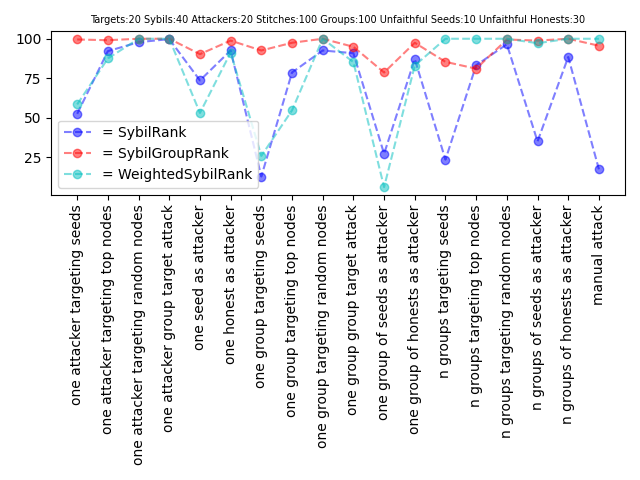
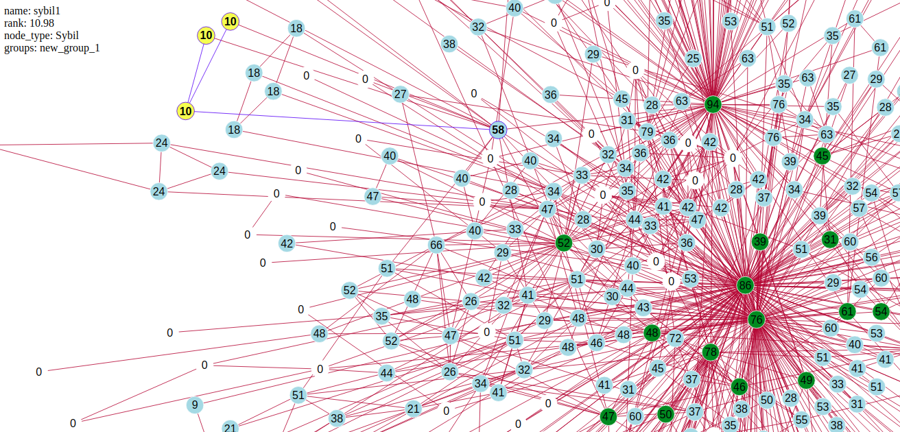

# BrightID Anti Sybil
This package provides a framework to generate different types of attacks and apply them on the BrightID's graph and to evaluate the quality of different anti sybil algorithms on them.

## Prerequisite
- Python3.7

## Install

    pip install anti_sybil

## Usage
We've modeled some types of simple attacks and algorithms. You can select different attacks and algorithms and configure them by editing the [config.py](https://github.com/BrightID/BrightID-AntiSybil/blob/py3/anti_sybil/tests/attacks/config.py) file.
Then you can run the attacks by

    python tests/attacks/run.py

The result will contain:
- An HTML file for each attack that contains an interactive model of the attack's graph

[Sample](assets/graph.html)

- A CSV file that contains some data about the result of the attacks

|Results                   |SybilRank                       |
|                          |one attacker targeting top nodes|
|--------------------------|--------------------------------|
|No. Successful Honests    |423                             |
|Successful Honests Percent|80.1136363636364                |
|Sybils scored >= %        |0.176470588235294               |
|Avg Honest - Avg Sybil    |13.174648989899                 |
|Max Seed                  |86.44                           |
|Avg Seed                  |46.3315151515152                |
|Min Seed                  |15.57                           |
|Max Honest                |84.16                           |
|Avg Honest                |18.499898989899                 |
|Min Honest                |0                               |
|Max Attacker              |13.99                           |
|Avg Attacker              |13.99                           |
|Min Attacker              |13.99                           |
|Max Sybil                 |8.7                             |
|Avg Sybil                 |5.32525                         |
|Min Sybil                 |3.99                            |
|Border                    |8                               |

[Sample](assets/result.csv)

- A chart to evaluate the quality of different anti-sybil algorithms against the attacks and compare the algorithms together.

[Sample](assets/1589538690.png)

#### Manual attack
The manual attack is a way to design your attack simply and apply it on the BrightID's graph and check the algorithms results.
You can design a new attack by editing MANUAL_ATTACK_OPTIONS in the [config.py](https://github.com/BrightID/BrightID-AntiSybil/blob/py3/anti_sybil/tests/attacks/config.py) file.
You can add new sybils (nodes), connections and groups to the BrightID's graph and select the algorithms to check the result of your attack.
This is one simple manual attack

    MANUAL_ATTACK_OPTIONS = {
        'top': True,
        'connections': [
            ['xGUyVQLYV80pajm8QP-9cfHC7xri49V58k02kqTAiUI', 'sybil1'],
            ['xGUyVQLYV80pajm8QP-9cfHC7xri49V58k02kqTAiUI', 'sybil2'],
            ['xGUyVQLYV80pajm8QP-9cfHC7xri49V58k02kqTAiUI', 'sybil3'],
            ['sybil1', 'sybil2'],
            ['sybil1', 'sybil3'],
        ],
        'groups': {
            'new_group_1': [
                'sybil1',
                'sybil2',
                'sybil3'
            ]
        }
    }

This is the modeled attack and results

[Sample](assets/manual_attack.html)

## Algorithms

### [SybilRank](https://github.com/BrightID/BrightID-AntiSybil/blob/py3/anti_sybil/algorithms/sybil_rank.py)
SybilRank distinguishes Sybil nodes from non-Sybil nodes based on their relative trustworthiness.

### [SybilGroupRank](https://github.com/BrightID/BrightID-AntiSybil/blob/py3/anti_sybil/algorithms/sybil_group_rank.py)
SybilGroupRank is an enhanced version of the SybilRank algorithm that makes specific use of groups to be able to reduce the effect of the attacks. We created a graph where the nodes are groups instead of users.

### [GroupSybilRank](https://github.com/BrightID/BrightID-AntiSybil/blob/py3/anti_sybil/algorithms/group_sybil_rank.py)
WeightedSybilRank is an enhanced version of the SybilRank algorithm that assigns a multiple to trust dispersed through intragroup edges.

### [GroupMergingRank](https://github.com/BrightID/BrightID-AntiSybil/blob/py3/anti_sybil/algorithms/group_merging.py)
This is a new  group-based (clustering) anti-sybil algorithm that assigns groups of nodes a trust score, which is, intuitively, the likelihood that the group is free from sybils.

### [WeightedSybilRank](https://github.com/BrightID/BrightID-AntiSybil/blob/py3/anti_sybil/algorithms/weighted_sybil_rank.py)
WeightedSybilRank is an enhanced version of the SybilRank algorithm that uses the number of common neighbors of the tow connected nodes as weight (trustworthy factor) of the edge.

## Attacks

### Lone Attacks
One attacker attempting to propagate score to the Sybils to verify them by connecting to other nodes and creating groups.
We assumed that an attacker will have one account with a normal or above-average number of direct connections to honest users which they can use for interconnections to sybil accounts.

#### [An attacker connects to the seeds](https://github.com/BrightID/BrightID-AntiSybil/blob/1ab4a45c55646ab53e358cc667a2ca82b6055de4/anti_sybil/tests/attacks/lone_attacks.py#L6)
One attacker attempts to connect to some of the seed nodes and create some sybil nodes.

#### [An attacker connects to the top-ranked honests](https://github.com/BrightID/BrightID-AntiSybil/blob/1ab4a45c55646ab53e358cc667a2ca82b6055de4/anti_sybil/tests/attacks/lone_attacks.py#L39)
One attacker attempts to connect to some of the top-ranked honests and create some sybil nodes.

#### [An attacker connects to the random honests](https://github.com/BrightID/BrightID-AntiSybil/blob/1ab4a45c55646ab53e358cc667a2ca82b6055de4/anti_sybil/tests/attacks/lone_attacks.py#L39)
One attacker attempts to connect to some of the honests and create some sybil nodes.

#### [An attacker connects to one top-ranked honest node and propagates the score by creating multiple groups](https://github.com/BrightID/BrightID-AntiSybil/blob/1ab4a45c55646ab53e358cc667a2ca82b6055de4/anti_sybil/tests/attacks/lone_attacks.py#L76)
One attacker attempts to connect to one of the top-ranked honests and create multiple (duplicate) groups of the sybils.

#### [A seed as an attacker](https://github.com/BrightID/BrightID-AntiSybil/blob/1ab4a45c55646ab53e358cc667a2ca82b6055de4/anti_sybil/tests/attacks/lone_attacks.py#L116)
A seed node attempts to create some sybils nodes.

#### [A honest as an attacker](https://github.com/BrightID/BrightID-AntiSybil/blob/1ab4a45c55646ab53e358cc667a2ca82b6055de4/anti_sybil/tests/attacks/lone_attacks.py#L116)
An honest node attempts to create some sybils nodes.

### Collaborative Attacks
Multiple attackers attempting to propagate score to the Sybils to verify them by connecting to other nodes and creating groups.
Attackers are able to connect to each other and each others’ sybil accounts in any way.
We assumed that each attacker will have one account with a normal or above-average number of direct connections to honest users which they can use for interconnections to sybil accounts.
All these attacks can be performed by one or more groups of attackers who collaborate together.

#### [Attackers connect to the seeds](https://github.com/BrightID/BrightID-AntiSybil/blob/1ab4a45c55646ab53e358cc667a2ca82b6055de4/anti_sybil/tests/attacks/collaborative_attacks.py#L6)
One or more groups of attackers attempt to connect to some of the seeds and create some sybil nodes.

#### [Attackers connect to the top-ranked honests](https://github.com/BrightID/BrightID-AntiSybil/blob/1ab4a45c55646ab53e358cc667a2ca82b6055de4/anti_sybil/tests/attacks/collaborative_attacks.py#L61)
One or more groups of attackers attempt to connect to some of the top-ranked honests and create some sybil nodes.

#### [Attackers connect to the random honests](https://github.com/BrightID/BrightID-AntiSybil/blob/1ab4a45c55646ab53e358cc667a2ca82b6055de4/anti_sybil/tests/attacks/collaborative_attacks.py#L61)
One or more groups of attackers attempt to connect to some honests and create some sybil nodes.

#### [Attackers connect to the top-ranked honests and propagate the score by creating multiple groups](https://github.com/BrightID/BrightID-AntiSybil/blob/1ab4a45c55646ab53e358cc667a2ca82b6055de4/anti_sybil/tests/attacks/collaborative_attacks.py#L121)
A group of attackers attempts to connect to some of the top-ranked honests  and create multiple (duplicate) groups of the sybils.

#### [A group of seeds as attackers](https://github.com/BrightID/BrightID-AntiSybil/blob/1ab4a45c55646ab53e358cc667a2ca82b6055de4/anti_sybil/tests/attacks/collaborative_attacks.py#L176)
One or more groups of seed nodes attempt to create some sybil nodes.

#### [A group of honests as attackers](https://github.com/BrightID/BrightID-AntiSybil/blob/1ab4a45c55646ab53e358cc667a2ca82b6055de4/anti_sybil/tests/attacks/collaborative_attacks.py#L176)
One or more groups of honest nodes attempt to create some sybil nodes.

## Anti-Sybil Algorithm Trials
We tested four different algorithms with different parameters. This was made possible through funding from Aragon. The documentation and output of these trials are below.

* [Anti-Sybil Milestone 2 notes](https://docs.google.com/document/d/1-mskGNiVxtoBWLRYypFXa003y1H9-ZAHJnXuc0i-xsE/edit#heading=h.44stmx2536if)
* [Anti-Sybil Milestone 5 notes](https://docs.google.com/document/d/1C4wX-NjypgKKd92puqJTt9AiAHu55oWm3LqWbPeOBDM/edit#heading=h.44stmx2536if)
